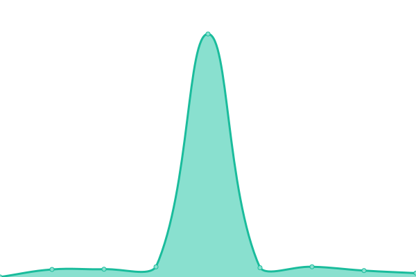

# [📈 Live Status](https://cosmic-fi.github.io/corenet-uptime): <!--live status--> **🟩 All systems operational**

This repository contains the open-source uptime monitor and status page for [Cosmic](https://cosmic-fi.github.io/corenet-uptime), powered by [Upptime](https://github.com/upptime/upptime).

With [Upptime](https://upptime.js.org), you can get your own unlimited and free uptime monitor and status page, powered entirely by a GitHub repository. We use [Issues](https://github.com/cosmic-fi/corenet-uptime/issues) as incident reports, [Actions](https://github.com/cosmic-fi/corenet-uptime/actions) as uptime monitors, and [Pages](https://cosmic-fi.github.io/corenet-uptime) for the status page.

<!--start: status pages-->
<!-- This summary is generated by Upptime (https://github.com/upptime/upptime) -->
<!-- Do not edit this manually, your changes will be overwritten -->
<!-- prettier-ignore -->
| URL | Status | History | Response Time | Uptime |
| --- | ------ | ------- | ------------- | ------ |
|  [Corenet Uptime](https://www.corenet.xyz) | 🟩 Up | [corenet-uptime.yml](https://github.com/cosmic-fi/corenet-uptime/commits/HEAD/history/corenet-uptime.yml) | 

 325ms
     
 | 

<a href="https://cosmic-fi.github.io/corenet-uptime/history/corenet-uptime">83.37%</a>
    

<!--end: status pages-->

[**Visit our status website →**](https://cosmic-fi.github.io/corenet-uptime)

## 📄 License

- Powered by: [Upptime](https://github.com/upptime/upptime)
- Code: [MIT](./LICENSE) © [Anand Chowdhary](https://anandchowdhary.com), supported by [Pabio](https://pabio.com)
- Data in the `./history` directory: [Open Database License](https://opendatacommons.org/licenses/odbl/1-0/)
